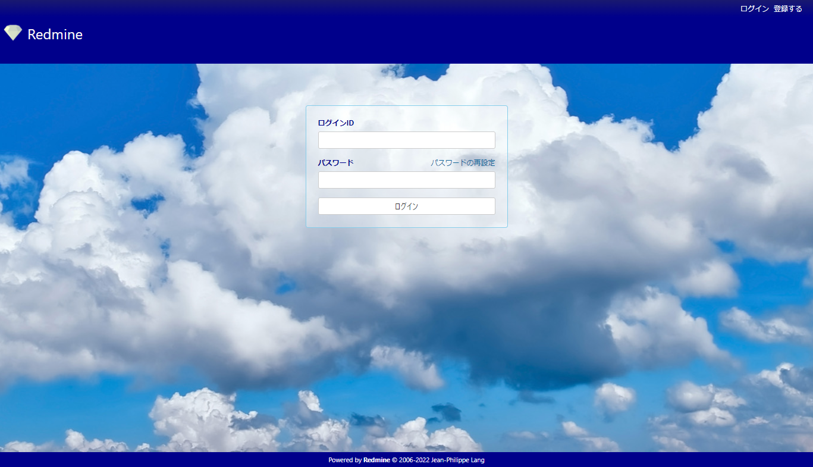
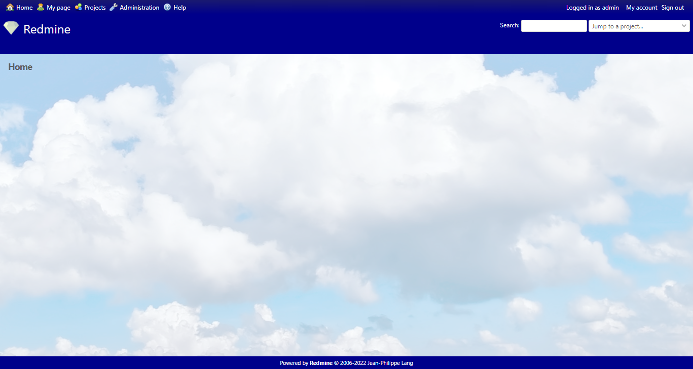
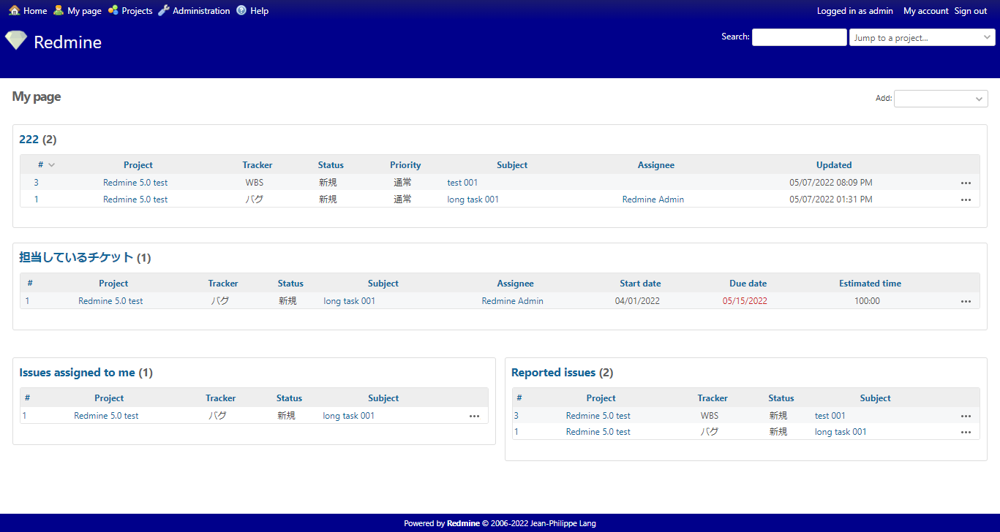
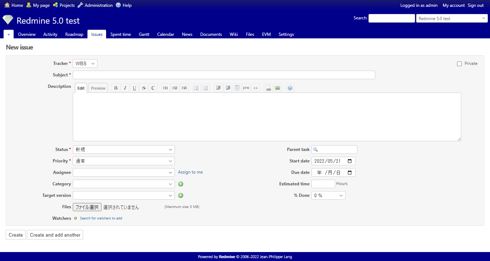
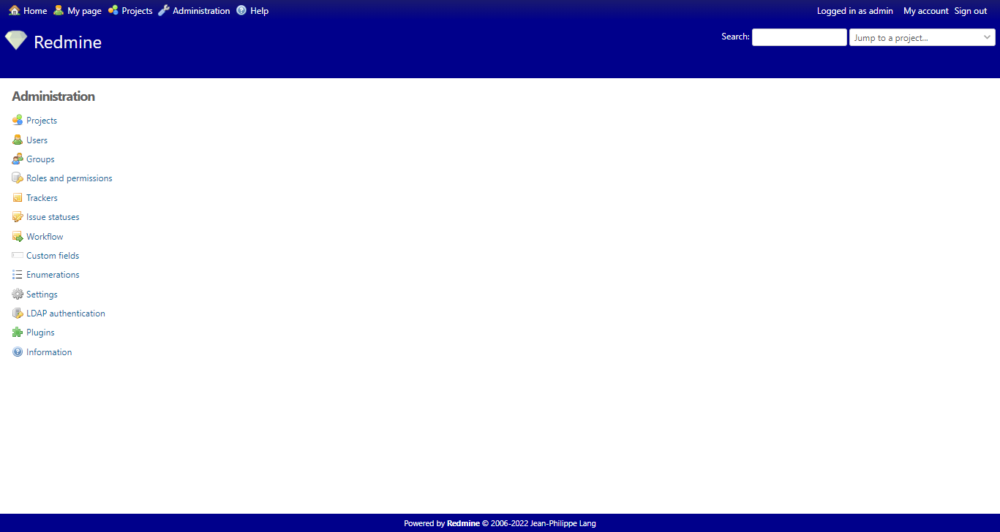
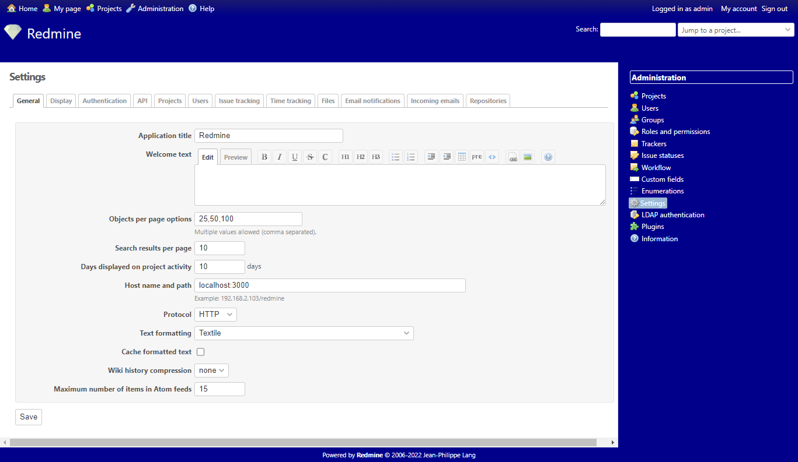
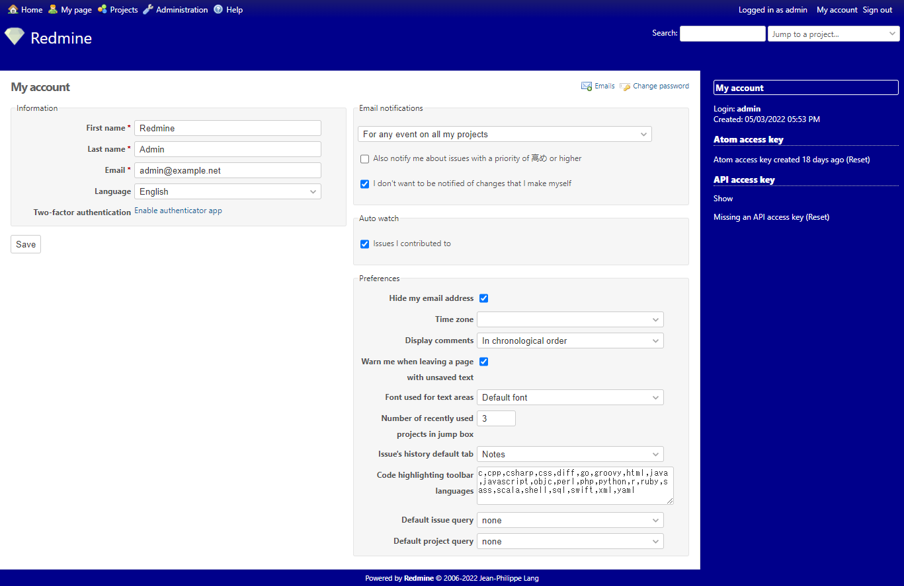

# ClassicBlue
Redmine theme based on Classic

# Screen shots
* Login


* Home


* My page


* Projects


* Administration


* Setting


* My account


# Instll

```
cd {redmine home}/public/themes
mkdir ClassicBlue
git clone https://github.com/momibun926/ClassicBlue ClassicBlue
```

Restart Redmine after the clone is complete.


